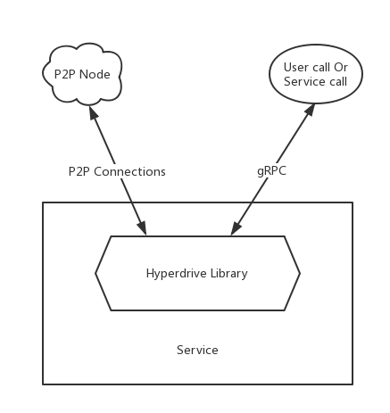
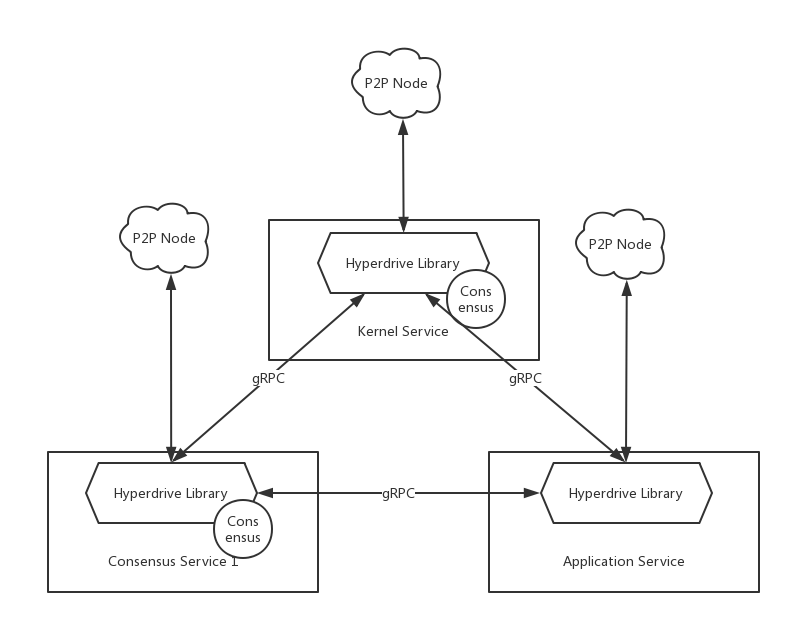

# Node architecture and services

- Status: proposed
- Category: architecture
- Author: tiannian &lt;dtiannian@aliyun.com&gt;
- Related components: Hyperdrive
- Start Date: 2018-11-28
- Discussion: 

## Summary

作为一个分布式应用的重要组成部分，节点的概念与架构是首先需要被定义与明确的。本RFC定义了节点Node的概念，节点的架构，以及节点的组成元素，Service。

## Conventions

- Node - 节点指网络中实际存在的一台设备，具有网络连接能力与计算，存储能力。
- Service - 服务是运行在节点上的程序，在本RFC下特指使用了Hyperdrive库实现的程序。每一个Service是一个独立的执行进程，需要实现Hyperdrive中定义的接口。
- Hyperdrive - Hyperdrive是一个通用的区块链开发框架。具体定义由后续RFC描述。
- Service Subnet - Service Subnet是Service直接进行P2P链接形成的网络。
- Grouping Network - 分片网络是网络中部分执行相同共识，拥有相同Grouping ID的Service组成的网络。

## Motivation

明确节点的概念与架构，为后续实现设计提供基础。

## Detailed design

### Node

节点是网络中实际存在的设备，网络中的每一个节点都具有与其他节点通讯的能力，同时拥有一定程度的计算，存储能力。

### Service

Service是节点上的程序，使用Hyperdrive开发，需要实现Hyperdrive中定义的接口。每一个Service均可以实现某一种去中心化应用的功能。在运行时Service表现为一个进程，由Service的实现负责计算与存储，由Hyperdrive负责具体的网络通讯与交互。

### Kernel Service

Kernel Service是第一个被启动的Service，就如同Linux操作系统中Init进程。对应到Tachion中，Kernel Service即是Level 2的实现，负责在各个节点间同步Level 2的区块信息[1]()。Kernel Service在节点上作为一个核心的转发机制存在，使用gRPC在节点的各个Service之间派发同步到的Level 2信息。Level 2采用的Consensus为PARSEC，因此在Kernel Service中实现的共识机制即PARSEC。

### Consensus Service

除去作为Level 2实现的Kernel Service，其余的实现了Hyperdrive中共识接口的Service被称为Consensus Service。Consensus Service作为Level 1的实现，可以自由实现不同种的共识机制。

### Application Service

如果一个Service并未实现Hyperdrive的共识接口，而仅仅是使用了Hyperdrive提供的数据，网络，计算等内容。这类的Service被称为Application Service。这些Service仅仅进行计算或者存储等本地资源的操作。此类Service适合实现分布式应用的功能，例如：去中心化存储，去中心化网络分发等。

### Inter Service Communication

Service之间的通讯通过Hyperdrive提供的gRPC进行。从系统整体上来说，系统整体的结构如下：

### Service Subnet

Service Subnet是节点中运行的Service与其他节点的Service组成的P2P通讯网络，这种通讯网络中可能发生共识，也可能仅仅是各个节点间进行的数据交换。Service Subnet要求参与者需要是不同节点上相同的Service。

### Grouping

当Service Subnet中发生共识行为时，这个Service Subnet将会成为一个网络中的共识分组，这种分组的网络被称为Grouping。每一个Grouping都会拥有Grouping ID。具体的Grouping ID与算法会在后续分组相关RFC中具体描述。

## Alternatives

PoC-style

## Copyright

Copyright and related rights waived via [CC0](https://creativecommons.org/publicdomain/zero/1.0/).